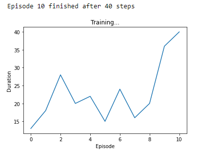
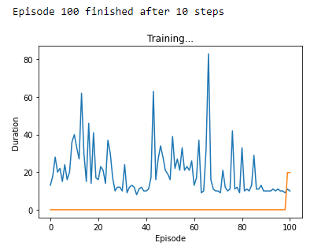

## Project Summary
Quantum computers are machines that use quantum phenomena such as superposition and entanglement to perform computation. They are believed to solve certain problems substantially faster than classical computers. The most famous quantum algorithm is Shor’s factoring algorithm which has exponential speed-up over any existing classical algorithm [1].

For our project, we will implement a quantum variant of Reinforcement Learning (RL), which employs the Parametrized/Variational Quantum Circuits (PQCs or VQCs). In contrast to most quantum algorithms that require fault-tolerant large-scale quantum computers, this algorithm employs small and low-depth circuits and is flexible under noises, thus it is believed to be useful already on near-term quantum computers. While Google already had a full implementation of the algorithm in tensorflow using Cirq [2], the other widely used quantum programming language Qiskit from IBM hasn’t. Therefore, we would like to fill this gap and have a working PQC-based QRL algorithm in Qiskit.

While the most promising direction is to run the algorithm implemented in Qiskit on real IBM quantum devices, investigate the effects of quantum noises, and demonstrate quantum advantage, it is not realistic due to several reasons: 1. The PQC-based QRL requires thousands of circuit re-runs, which IBM devices disallow. 2. There are many layers of classical processing on IBM’s side, which would be very slow and hinder the accurate benchmark of speed. 3. The circuit requests are usually queued, and there is no guarantee when our requests will be finished (sometimes takes months). Therefore, our work will be a proof of concept, where we use classical simulations of quantum circuits to demonstrate this algorithm works. 

## Approach

The algorithm we implemented is based on [3], where the algorithm flow is as follows:

The environment and the gradient algorithm are both implemented classically as the standard RL algorithm, while the policy is encoded in a PQC. The PQC can be thought of as a black box, which takes the state as input and outputs the probability distribution of actions. The gradient can also be calculated directly by applying different measurement observables on the circuit. The PQC architecture is as follows:

where one repetitively applies the entangling layers and encoding layers. The entangling layer applies unitary rotations on each qubit with trainable parameters Φ and applies two qubit-gates on adjacent qubits (under periodic boundary condition) to entangle them. The encoding layer applies another round of rotations with the encoded state as parameters, which are also scaled by trainable weight parameters λ. The unitary rotations can be arbitrarily chosen from any SU(2) rotations generated by Pauli gates, and there is no particular advantage of one over another. To fit this paper’s context, we choose the same convention Ry and Rz, which have the following matrix representation on the computational basis:

There are many contexts not explained, and interested readers should refer to wiki page https://en.wikipedia.org/wiki/Bloch_sphere#Rotations and more general Quantum Computing tutorials.

To best build our model, we will employ the newly added TorchConnector module in Qiskit. A typical flow looks like this:

where one adopts a neural network-like structure with one layer replaced by the PQC. However, one flaw of the TorchConnector is it can only perform projective measurement on the computational basis, corresponding to the raw-VQC policy in [3]:

while it is proposed in [3] a more general measurement under arbitrary Hermitian observable is required. Therefore, we add an “observable layer” directly after PQC that transforms the projective measurement results into general Hermitain obervables. For now, we only consider the Hermitian Z operator as the observable, and we derived such mapping:

where |Pa| is the sum of digits (number of 1s) in the associated action’s binary representation. More general transformations will be implemented in the future. Therefore, our policy will have this underlying flow: 

Notice because our PQC already encodes the scaling/weight parameters for the state, there’s no need to add another classical layer before PQC.

For our task, we decided to train the CartPole-v0 task from the OpenAI Gym. In this environment, a pole is attached by an un-actuated joint to a cart, which moves along a frictionless track. The system is controlled by applying a force of +1 or -1 to the cart. The pendulum starts upright, and the goal is to prevent it from falling over. A reward of +1 is provided for every timestep that the pole remains upright. The episode ends when the pole is more than 15 degrees from vertical, or the cart moves more than 2.4 units from the center.

We adopted codes from PyTorch’s tutorials [4] and apply our quantum model to it. In this code, the Huber loss is used for optimization, which is implemented in PyTorch already. We could simply apply the following code without actually coding the gradient algorithm ourselves:

## Evaluation

## Remaining Goals and Challenges
In the next few weeks, we plan to compare the QRL to its classical counterparts. As of now, our prototype only plots the length of each episode and its 100 episode averages. This would not be enough to provide a sufficient evaluation of the algorithm. Therefore, we plan to add more points of comparison. This would include adding a graph to show the score for each episode along with its 100 episode averages and possible other similar graphs if time allows.

Furthermore, we plan to implement or find an implementation of the QRL’s classical counterpart in order to have a baseline to compare to. The classical Q-learning implementation will allow us to gauge if the QRL algorithm is working properly and how well it works. Afterwards, if we can, we will try to apply both the QRL and classical algorithms onto another task and compare those results.

Based on our experience so far, the biggest challenge that we will face and have been facing is the amount of time that it takes to run and train the QRL agent. Currently, it takes about 20 continuous hours, assuming that nothing else occurs that would slow down the program. This issue will pose a large problem due to the limited time frame that we have, limiting the number of runs that are possible. Some possible solutions that we might try include: changing the data types of our data, reducing the number of training episodes, or making functions less complex.      

## Resources Used
